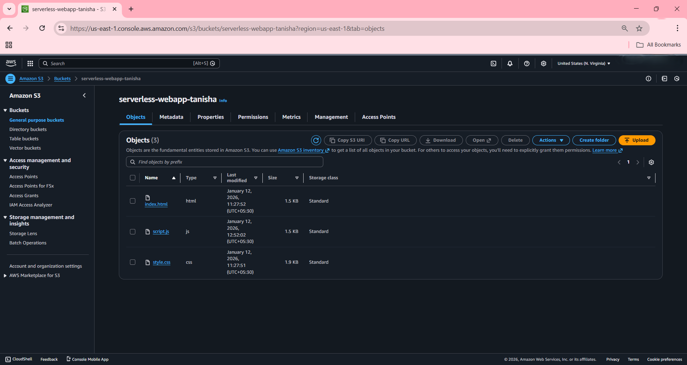
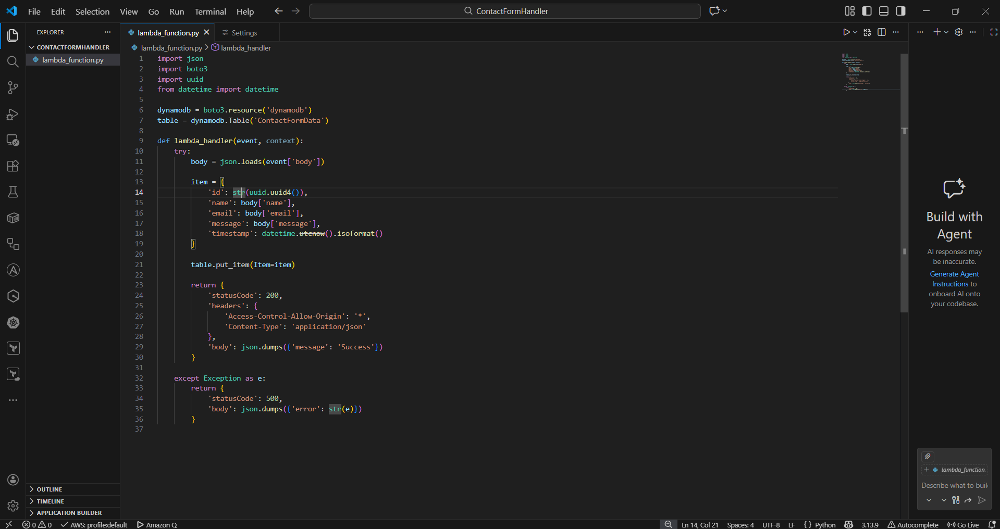
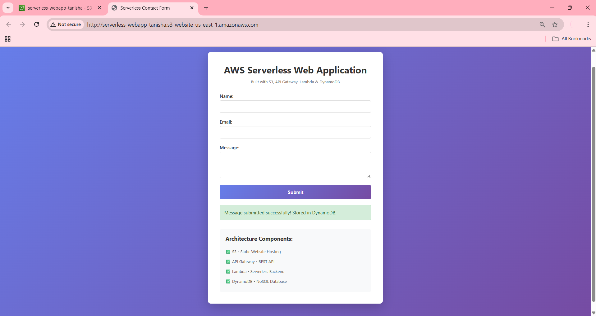
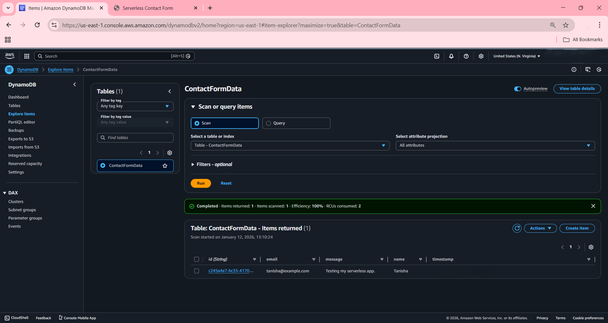

# AWS Serverless Web Application 🚀


A production-grade serverless contact form application built entirely on AWS. This project demonstrates modern cloud-native architecture patterns used by companies like Netflix, Airbnb, and Uber.

## 📋 Table of Contents
- [Overview](#overview)
- [Architecture](#architecture)
- [Features](#features)
- [Technologies Used](#technologies-used)
- [Prerequisites](#prerequisites)
- [Installation & Deployment](#installation--deployment)
- [Project Structure](#project-structure)
- [API Documentation](#api-documentation)
- [Screenshots](#screenshots)
- [Cost Analysis](#cost-analysis)
- [Key Learnings](#key-learnings)
- [Future Enhancements](#future-enhancements)
- [Contributing](#contributing)
- [License](#license)
- [Contact](#contact)

---

## 🎯 Overview

This project is a **fully functional serverless web application** that handles contact form submissions using AWS services. It demonstrates:

- ✅ Event-driven serverless architecture
- ✅ RESTful API design and integration
- ✅ NoSQL database operations
- ✅ Cloud security best practices (IAM, CORS)
- ✅ Infrastructure monitoring and logging
- ✅ Cost-optimized cloud solution

**Real-World Use Case:** This architecture pattern is commonly used for contact forms, user registration systems, data collection, and microservices backends in production environments.

---

## 🏗️ Architecture

```
┌─────────────┐
│   Browser   │
│   (User)    │
└──────┬──────┘
       │ HTTP Request
       ▼
┌─────────────────┐
│   Amazon S3     │
│ Static Website  │
│ (HTML/CSS/JS)   │
└──────┬──────────┘
       │ API Call
       ▼
┌─────────────────┐
│  API Gateway    │
│  REST API       │
│  /contact POST  │
└──────┬──────────┘
       │ Trigger
       ▼
┌─────────────────┐
│  AWS Lambda     │
│  Python 3.12    │
│  Backend Logic  │
└──────┬──────────┘
       │ Store Data
       ▼
┌─────────────────┐
│   DynamoDB      │
│  NoSQL Database │
│  ContactFormData│
└─────────────────┘
       │
       ▼
┌─────────────────┐
│  CloudWatch     │
│  Logs & Monitor │
└─────────────────┘
```

### Architecture Components:

1. **Amazon S3** - Hosts static website files (HTML, CSS, JavaScript)
2. **API Gateway** - Provides RESTful API endpoint for form submissions
3. **AWS Lambda** - Executes backend logic (Python) in response to API calls
4. **DynamoDB** - Stores contact form data in NoSQL database
5. **CloudWatch** - Monitors application performance and logs

---

## ✨ Features

- 🌐 **Static Website Hosting** - Fast, reliable hosting on S3
- 🔌 **RESTful API** - Clean API design with proper HTTP methods
- ⚡ **Serverless Backend** - No server management required
- 💾 **NoSQL Database** - Scalable data storage with DynamoDB
- 🔒 **Security** - IAM roles, CORS configuration, secure API
- 📊 **Monitoring** - CloudWatch logs and metrics
- 💰 **Cost-Effective** - Pay only for what you use
- 📈 **Auto-Scaling** - Handles traffic spikes automatically
- 🚀 **Production-Ready** - Industry-standard architecture

---

## 🛠️ Technologies Used

| Technology | Purpose | Version |
|------------|---------|---------|
| **HTML5/CSS3** | Frontend UI | - |
| **JavaScript (ES6+)** | Client-side logic | - |
| **Python** | Backend logic | 3.12 |
| **Amazon S3** | Static hosting | - |
| **API Gateway** | REST API | v2 |
| **AWS Lambda** | Serverless compute | - |
| **DynamoDB** | NoSQL database | - |
| **CloudWatch** | Monitoring & logs | - |
| **IAM** | Security & permissions | - |

---

## 📦 Prerequisites

Before you begin, ensure you have:

- AWS Account (Free Tier eligible)
- AWS CLI installed and configured
- Basic knowledge of AWS services
- Text editor (VS Code recommended)
- Git installed

---

## 🚀 Installation & Deployment

### Step 1: Clone the Repository

```bash
git clone https://github.com/YOUR_USERNAME/aws-serverless-webapp.git
cd aws-serverless-webapp
```

### Step 2: Create S3 Bucket

```bash
# Create bucket (replace with unique name)
aws s3 mb s3://serverless-webapp-yourname --region us-east-1

# Enable static website hosting
aws s3 website s3://serverless-webapp-yourname --index-document index.html

# Upload files
aws s3 sync ./frontend s3://serverless-webapp-yourname --acl public-read
```

### Step 3: Create DynamoDB Table

```bash
aws dynamodb create-table \
    --table-name ContactFormData \
    --attribute-definitions AttributeName=id,AttributeType=S \
    --key-schema AttributeName=id,KeyType=HASH \
    --billing-mode PAY_PER_REQUEST \
    --region us-east-1
```

### Step 4: Deploy Lambda Function

```bash
# Create deployment package
cd lambda
zip function.zip lambda_function.py

# Create Lambda function
aws lambda create-function \
    --function-name ContactFormHandler \
    --runtime python3.12 \
    --role arn:aws:iam::YOUR_ACCOUNT_ID:role/lambda-execution-role \
    --handler lambda_function.lambda_handler \
    --zip-file fileb://function.zip \
    --region us-east-1
```

### Step 5: Create API Gateway

```bash
# Create REST API
aws apigateway create-rest-api \
    --name ContactFormAPI \
    --region us-east-1

# Configure resources and methods (see AWS Console for detailed steps)
```

### Step 6: Update Frontend with API URL

Edit `frontend/script.js` and replace `YOUR_API_URL` with your actual API Gateway endpoint.

### Step 7: Test the Application

Open your S3 website URL in a browser and test the contact form!

---

## 📁 Project Structure

```
aws-serverless-webapp/
│
├── frontend/
│   ├── index.html          # Main HTML file
│   ├── style.css           # Styling
│   └── script.js           # Frontend logic
│
├── lambda/
│   └── lambda_function.py  # Backend logic
│
├── screenshots/
│   ├── architecture.png
│   ├── s3-bucket.png
│   ├── lambda-function.png
│   ├── api-gateway.png
│   ├── working-app.png
│   └── dynamodb-data.png
│
├── docs/
│   └── API_DOCUMENTATION.md
│
├── README.md
├── LICENSE
└── .gitignore
```

---

## 📡 API Documentation

### Endpoint

```
POST https://YOUR_API_ID.execute-api.us-east-1.amazonaws.com/prod/contact
```

### Request Headers

```json
{
  "Content-Type": "application/json"
}
```

### Request Body

```json
{
  "name": "John Doe",
  "email": "john@example.com",
  "message": "Hello, this is a test message!",
  "timestamp": "2025-01-12T10:30:00Z"
}
```

### Success Response (200 OK)

```json
{
  "message": "Data saved successfully",
  "id": "uuid-123-456-789"
}
```

### Error Response (500 Internal Server Error)

```json
{
  "message": "Error",
  "error": "Error description"
}
```

---

## 📸 Screenshots

### 1. Architecture Diagram


### 2. S3 Bucket Configuration


### 3. Lambda Function


### 4. API Gateway


### 5. Working Application


### 6. DynamoDB Data


---

## 💰 Cost Analysis

### AWS Free Tier Limits

| Service | Free Tier | Estimated Usage | Cost |
|---------|-----------|-----------------|------|
| S3 | 5 GB storage | ~1 MB | $0.00 |
| Lambda | 1M requests/month | ~100 requests | $0.00 |
| API Gateway | 1M requests/month | ~100 requests | $0.00 |
| DynamoDB | 25 GB storage | ~10 KB | $0.00 |
| CloudWatch | 5 GB logs | ~50 MB | $0.00 |

**Total Monthly Cost:** $0.00 (within Free Tier limits) 💰

---

## 🎓 Key Learnings

### Technical Skills Gained
- ✅ Serverless architecture design patterns
- ✅ RESTful API development and integration
- ✅ Event-driven programming concepts
- ✅ NoSQL database operations (DynamoDB)
- ✅ Cloud security implementation (IAM, CORS)
- ✅ Infrastructure monitoring and logging
- ✅ Cost optimization strategies

### DevOps Practices
- ✅ Infrastructure as Code mindset
- ✅ Deployment automation
- ✅ Monitoring and observability
- ✅ Security best practices
- ✅ Scalability considerations

---

## 🔮 Future Enhancements

- [ ] Add email notifications using Amazon SNS + SES
- [ ] Implement user authentication with Amazon Cognito
- [ ] Add input validation and data sanitization
- [ ] Create admin dashboard for viewing submissions
- [ ] Implement CI/CD pipeline with AWS CodePipeline
- [ ] Add automated testing (unit & integration tests)
- [ ] Implement rate limiting and throttling
- [ ] Add analytics and reporting features
- [ ] Multi-language support
- [ ] Dark mode toggle

---

## 🤝 Contributing

Contributions are welcome! Please follow these steps:

1. Fork the repository
2. Create a feature branch (`git checkout -b feature/AmazingFeature`)
3. Commit your changes (`git commit -m 'Add some AmazingFeature'`)
4. Push to the branch (`git push origin feature/AmazingFeature`)
5. Open a Pull Request

---

## 📄 License

This project is licensed under the MIT License - see the [LICENSE](LICENSE) file for details.

---

## 📞 Contact

**Your Name** - Tanisha

- LinkedIn: [Your LinkedIn Profile](https://linkedin.com/in/yourprofile)
- Email: your.email@example.com
- GitHub: [@yourusername](https://github.com/yourusername)

---

## 🙏 Acknowledgments

- AWS Documentation and tutorials
- Serverless architecture best practices
- Cloud computing community
- Open source contributors

---

## ⭐ Show Your Support

If you found this project helpful, please give it a ⭐️!

---

**Built with ❤️ using AWS Free Tier**

*This project demonstrates production-grade serverless architecture suitable for internship portfolios and job applications.*
